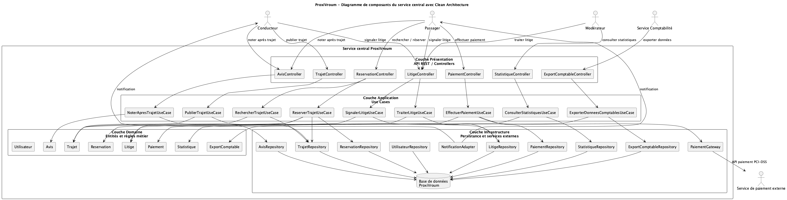

# Exercice 3 — Architecture cible ProxiVroum

## 1. Introduction

L'objectif de cette architecture cible est de définir une organisation logicielle claire, maintenable et adaptée au projet ProxiVroum, plateforme régionale de covoiturage. Elle vise à structurer le service central autour de responsabilités métier distinctes, tout en conservant une architecture modulaire orientée services.

Cette architecture doit permettre de faire évoluer les fonctionnalités principales du projet, comme la publication de trajets, la réservation, le paiement, les avis, la modération, les statistiques et les exports comptables, sans introduire une complexité excessive. Elle doit également prendre en compte les contraintes de conformité, notamment le RGPD pour la protection des données personnelles, ainsi que la délégation du paiement à un prestataire externe conforme PCI-DSS.

Enfin, la plateforme doit être conçue pour supporter les pics de charge liés aux usages du covoiturage, en particulier le vendredi soir et le dimanche soir, périodes pendant lesquelles les recherches et réservations de trajets peuvent augmenter fortement.

## 2. Identification des Bounded Contexts

| Bounded Context | Responsabilité métier | Entités principales | Acteurs concernés |
| --- | --- | --- | --- |
| Gestion des utilisateurs | Gère les profils, rôles et informations des utilisateurs. | Utilisateur, Role | Conducteur, Passager, Modérateur, Service Comptabilité |
| Gestion des trajets | Gère la publication et le suivi des trajets. | Trajet, StatutTrajet | Conducteur, Passager |
| Recherche et réservation | Gère la recherche de trajets disponibles et la réservation de places. | Reservation, StatutReservation, Trajet | Passager |
| Paiement | Gère le paiement des réservations et la communication avec le prestataire externe. | Paiement, StatutPaiement | Passager, Service de paiement externe |
| Avis et notation | Gère les avis déposés après un trajet. | Avis, Utilisateur, Trajet | Conducteur, Passager |
| Litiges et modération | Gère le signalement et le traitement des litiges. | Litige, StatutLitige | Passager, Conducteur, Modérateur |
| Statistiques et comptabilité | Gère les statistiques et les exports comptables. | Statistique, ExportComptable | Modérateur, Service Comptabilité |

Ce découpage en Bounded Contexts permet de séparer les responsabilités métier de manière explicite. Chaque contexte regroupe un vocabulaire, des règles et des entités cohérentes, ce qui réduit le couplage entre les différentes parties du système. Cette séparation améliore la maintenabilité de la plateforme, facilite les évolutions futures et permet de limiter les impacts lorsqu'une fonctionnalité doit être modifiée.

## 3. Architecture cible globale

ProxiVroum adopte une architecture modulaire orientée services. Le système reste organisé autour d'un service central, mais celui-ci est découpé en modules métier correspondant aux principaux Bounded Contexts identifiés. Cette approche évite de transformer le projet en une architecture microservices complexe, tout en permettant une séparation claire des responsabilités.

Le service central expose les fonctionnalités aux interfaces Web et Mobile. Il communique avec une base de données pour la persistance des informations métier et avec un prestataire externe pour le paiement. Le paiement est délégué à un prestataire externe conforme PCI-DSS, afin de ne pas stocker ni traiter directement les données sensibles de carte bancaire dans la plateforme ProxiVroum.

La plateforme doit également respecter le RGPD. Les données personnelles des utilisateurs doivent être limitées aux besoins métier, protégées contre les accès non autorisés et conservées selon des règles compatibles avec les finalités du service.

```text
Frontend Web / Mobile
        |
        v
Service central ProxiVroum
        |
        |-- Gestion des utilisateurs
        |-- Gestion des trajets
        |-- Recherche et réservation
        |-- Paiement
        |-- Avis et notation
        |-- Litiges et modération
        |-- Statistiques et comptabilité
        |
        v
Base de données / Prestataire externe de paiement
```

Cette architecture doit pouvoir absorber les pics de charge, notamment le vendredi soir et le dimanche soir. Les modules les plus sollicités, comme la recherche de trajets, la réservation et le paiement, doivent donc être conçus pour rester disponibles et performants pendant ces périodes.

## 4. Clean Architecture du service central

Le service central ProxiVroum est organisé selon les principes de la Clean Architecture. Les dépendances vont des couches externes vers les couches internes : la couche Présentation appelle la couche Application, qui orchestre les règles métier du Domaine et utilise les interfaces ou adaptateurs de la couche Infrastructure.

### 4.1 Couche Présentation

La couche Présentation expose les API REST utilisées par les acteurs du système. Elle reçoit les requêtes, valide les entrées nécessaires et délègue le traitement aux cas d'utilisation de la couche Application.

Composants :

- TrajetController
- ReservationController
- PaiementController
- AvisController
- LitigeController
- StatistiqueController
- ExportComptableController

### 4.2 Couche Application / Use Cases

La couche Application orchestre les cas d'utilisation métier. Elle coordonne les entités du domaine, applique les scénarios fonctionnels et sollicite les ports ou repositories nécessaires.

Composants :

- PublierTrajetUseCase
- RechercherTrajetUseCase
- ReserverTrajetUseCase
- EffectuerPaiementUseCase
- NoterApresTrajetUseCase
- SignalerLitigeUseCase
- TraiterLitigeUseCase
- ConsulterStatistiquesUseCase
- ExporterDonneesComptablesUseCase

### 4.3 Couche Domaine

La couche Domaine contient les entités principales et les règles métier fondamentales de ProxiVroum. Elle constitue le coeur fonctionnel du système et doit rester indépendante des détails techniques.

Composants :

- Utilisateur
- Trajet
- Reservation
- Paiement
- Avis
- Litige
- Statistique
- ExportComptable

### 4.4 Couche Infrastructure

La couche Infrastructure gère les dépendances techniques du service central. Elle contient les implémentations liées à la persistance, aux communications externes et aux services techniques.

Composants :

- Repositories
- Base de données
- PaiementGateway
- PrestatairePaiementExterne
- NotificationAdapter

## 5. Diagramme de composants du service central

Le diagramme ci-dessous représente le service central ProxiVroum selon une organisation en Clean Architecture.



Le code PlantUML utilisé pour générer ce diagramme est conservé ci-dessous.

```plantuml
@startuml
title ProxiVroum - Diagramme de composants du service central avec Clean Architecture

skinparam componentStyle rectangle
skinparam packageStyle rectangle
skinparam shadowing false

actor "Conducteur" as Conducteur
actor "Passager" as Passager
actor "Modérateur" as Moderateur
actor "Service Comptabilité" as Comptabilite
actor "Service de paiement externe" as PaiementExterne

package "Service central ProxiVroum" {

  package "Couche Présentation\nAPI REST / Controllers" {
    component "TrajetController" as TrajetController
    component "ReservationController" as ReservationController
    component "PaiementController" as PaiementController
    component "AvisController" as AvisController
    component "LitigeController" as LitigeController
    component "StatistiqueController" as StatistiqueController
    component "ExportComptableController" as ExportController
  }

  package "Couche Application\nUse Cases" {
    component "PublierTrajetUseCase" as PublierTrajet
    component "RechercherTrajetUseCase" as RechercherTrajet
    component "ReserverTrajetUseCase" as ReserverTrajet
    component "EffectuerPaiementUseCase" as EffectuerPaiement
    component "NoterApresTrajetUseCase" as NoterTrajet
    component "SignalerLitigeUseCase" as SignalerLitige
    component "TraiterLitigeUseCase" as TraiterLitige
    component "ConsulterStatistiquesUseCase" as ConsulterStats
    component "ExporterDonneesComptablesUseCase" as ExporterCompta
  }

  package "Couche Domaine\nEntités et règles métier" {
    component "Utilisateur" as Utilisateur
    component "Trajet" as Trajet
    component "Reservation" as Reservation
    component "Paiement" as Paiement
    component "Avis" as Avis
    component "Litige" as Litige
    component "Statistique" as Statistique
    component "ExportComptable" as ExportComptable
  }

  package "Couche Infrastructure\nPersistance et services externes" {
    component "UtilisateurRepository" as UtilisateurRepo
    component "TrajetRepository" as TrajetRepo
    component "ReservationRepository" as ReservationRepo
    component "PaiementRepository" as PaiementRepo
    component "AvisRepository" as AvisRepo
    component "LitigeRepository" as LitigeRepo
    component "StatistiqueRepository" as StatRepo
    component "ExportComptableRepository" as ExportRepo
    component "PaiementGateway" as PaiementGateway
    component "NotificationAdapter" as NotificationAdapter
    database "Base de données\nProxiVroum" as DB
  }
}

Conducteur --> TrajetController : publier trajet
Conducteur --> AvisController : noter après trajet
Conducteur --> LitigeController : signaler litige

Passager --> ReservationController : rechercher / réserver
Passager --> PaiementController : effectuer paiement
Passager --> AvisController : noter après trajet
Passager --> LitigeController : signaler litige

Moderateur --> LitigeController : traiter litige
Moderateur --> StatistiqueController : consulter statistiques

Comptabilite --> ExportController : exporter données

TrajetController --> PublierTrajet
ReservationController --> RechercherTrajet
ReservationController --> ReserverTrajet
PaiementController --> EffectuerPaiement
AvisController --> NoterTrajet
LitigeController --> SignalerLitige
LitigeController --> TraiterLitige
StatistiqueController --> ConsulterStats
ExportController --> ExporterCompta

PublierTrajet --> Trajet
RechercherTrajet --> Trajet
ReserverTrajet --> Reservation
ReserverTrajet --> Trajet
EffectuerPaiement --> Paiement
NoterTrajet --> Avis
SignalerLitige --> Litige
TraiterLitige --> Litige
ConsulterStats --> Statistique
ExporterCompta --> ExportComptable

PublierTrajet --> TrajetRepo
RechercherTrajet --> TrajetRepo
ReserverTrajet --> ReservationRepo
ReserverTrajet --> TrajetRepo
EffectuerPaiement --> PaiementRepo
EffectuerPaiement --> PaiementGateway
NoterTrajet --> AvisRepo
SignalerLitige --> LitigeRepo
TraiterLitige --> LitigeRepo
ConsulterStats --> StatRepo
ExporterCompta --> ExportRepo

UtilisateurRepo --> DB
TrajetRepo --> DB
ReservationRepo --> DB
PaiementRepo --> DB
AvisRepo --> DB
LitigeRepo --> DB
StatRepo --> DB
ExportRepo --> DB

PaiementGateway --> PaiementExterne : API paiement PCI-DSS
NotificationAdapter --> Conducteur : notification
NotificationAdapter --> Passager : notification

@enduml
```


